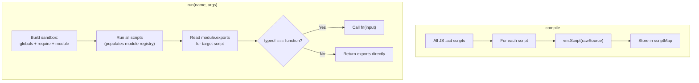

# CommonJS Script Refactor and Test Framework

## Motivation

The current JS engine uses regex-based source transforms to rewrite `import`/`export` syntax and wrap script bodies in IIFEs. This means the `.act` files are not actually valid JavaScript — they cannot be run standalone, they are harder to reason about, and every future developer (including an AI agent with no conversation context) has to learn the custom transform rules.

Switching to CommonJS eliminates all transforms. The scripts become real JavaScript that could be run with `node` given a mock environment. The API globals stay injected into the VM context, so scripts use `$som`, `$toks`, `$locs` etc. without any import ceremony — just like `fs` or `process` in Node.

## Todos

| ID | Task | Status |
|----|------|--------|
| refactor-runner | Rewrite JSActionRunner: remove all source transforms, inject `require`/`module` into sandbox, read `module.exports` after execution | pending |
| refactor-scripts | Rewrite all 5 ported .act scripts to use CommonJS (`require`/`module.exports`) | pending |
| test-harness | Create generic test harness at `vtt-game-server/tests/harness/ScriptTestEnv.ts` | pending |
| crucible-tests | Create crucible-specific test at `vtt-game-server/tests/crucible/combatTests.ts` | pending |
| verify-e2e | Reseed Crucible campaign, restart server, run tests end-to-end | pending |

## Script Format After Refactor

### Library scripts (e.g. combatUtils.act, reports.act)

```javascript
// @engine js

function getAimDir(aX, aZ, tX, tZ) {
    let dx = tX - aX;
    let dz = tZ - aZ;
    let dist = Math.sqrt(dx * dx + dz * dz);
    return { dirX: dist > 0.01 ? dx / dist : 0, dirZ: dist > 0.01 ? dz / dist : 1, distance: dist };
}

function intersectAABB(aX, aZ, dirX, dirZ, tok) { /* ... */ }

module.exports = { getAimDir, intersectAABB, rotateDir, traceShotDir, getAttackerData };
```

- Plain functions at module scope
- API globals (`$som`, `$toks`) used directly inside functions — they are in the VM context
- `module.exports` is an object containing the public functions

### Entry scripts (e.g. calculateHitChance.act, resolveAttack.act)

```javascript
// @engine js
const { getAttackerData, getAimDir } = require("combatUtils");

module.exports = function(input) {
    let data = getAttackerData(input.sourceID);
    if (!data) return { labels: [] };
    // ... computation ...
    return { labels };
};
```

- `require()` to pull in libraries
- `module.exports` is a **function** that receives `input` and returns the action output
- No top-level `return` — the function body handles it

## JSActionRunner Changes



Key changes to `vtt-game-server/src/Engine/Compiler/Actions/JSActionRunner.ts`:
- Delete `wrapModule()` entirely — no source transforms
- `compile()`: just `new vm.Script(source)` on the raw source, cache it
- `run()`: build sandbox with `require` function (looks up module registry) and fresh `module` object per script, run all scripts in dependency order, then call the target's exported function with `input`
- The sandbox still contains all API globals from `VMApiProxy.ts` — those do not change

## VMApiProxy Changes

Minimal — `VMApiProxy.ts` stays mostly the same. Only change: remove legacy compat fields (`__modules`, `__require`, `__logs`). The `input` field moves out of the sandbox since entry scripts now receive `input` as a function argument. The sandbox just provides the globals.

## Test Framework

### Generic harness: ScriptTestEnv

New file: `vtt-game-server/tests/harness/ScriptTestEnv.ts`

Builds on the pattern from `vtt-game-server/tests/unit/testEnv.ts` but does not require a campaign memento file on disk. Instead it creates a bare `Engine` and provides helpers to populate it programmatically:

```
class ScriptTestEnv {
    engine: Engine;

    constructor() — creates Engine, no deserialization
    addLocation(name, grid) — creates a location with grid config
    addToken(locName, name, position, dimensions, soRef) — adds a token to a location
    addCharacter(name, mods) — creates a state object (character) with mods
    addScript(name, source) — loads a .act script into the engine and compiles
    loadScriptsFromDir(dirPath) — loads all .act files from a directory
    run(name, input) — calls doAction, returns { out, logs, transaction }
}
```

This is game-agnostic — it knows nothing about Crucible.

### Crucible test setup

New file: `vtt-game-server/tests/crucible/combatTests.ts`

Uses `ScriptTestEnv` to:
1. Load all Crucible `.act` scripts from `crucible/src/_system/actions/`
2. Create a location with a 40x40 grid, tileSize 5
3. Create Alpha (position -60,0) and Charlie (position 60,50) with 15x15 dimensions, linked to state objects with weapon mods (accuracy.base=10, etc.)
4. Run `calculateHitChance` with Alpha aiming at Charlie's center — assert labels array has 1 entry, percentage is deterministic (no randomness in this calculation)
5. Run `resolveAttack` with Alpha aiming at Charlie — assert report structure has console output, effects array has cone + line entries

Run with: `npx ts-node tests/crucible/combatTests.ts`

No Jest dependency needed — just a simple script with assertions that prints PASS/FAIL. Can upgrade to Jest later if desired.

## Files Modified

| File | Change |
|------|--------|
| `vtt-game-server/src/Engine/Compiler/Actions/JSActionRunner.ts` | Rewrite: remove source transforms, use CommonJS module pattern |
| `vtt-game-server/src/Engine/Compiler/Actions/VMApiProxy.ts` | Minor cleanup: remove `__modules`, `__require`, `__logs` from sandbox |
| `crucible/src/_system/actions/combat/combatUtils.act` | Rewrite: `export function` -> plain functions + `module.exports = { ... }` |
| `crucible/src/_system/actions/combat/calculateHitChance.act` | Rewrite: `import` -> `require`, body wrapped in `module.exports = function(input) { ... }` |
| `crucible/src/_system/actions/combat/resolveAttack.act` | Same pattern as calculateHitChance |
| `crucible/src/_system/actions/combat/weaponAttack.act` | Same pattern |
| `crucible/src/_system/actions/utility/reports.act` | Rewrite: `export function` -> plain functions + `module.exports = { ... }` |
| `vtt-game-server/tests/harness/ScriptTestEnv.ts` | **New**: generic engine test harness |
| `vtt-game-server/tests/crucible/combatTests.ts` | **New**: Crucible combat action tests |
